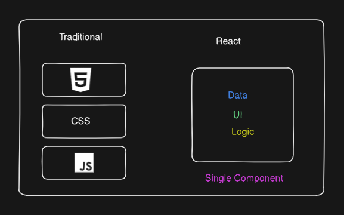
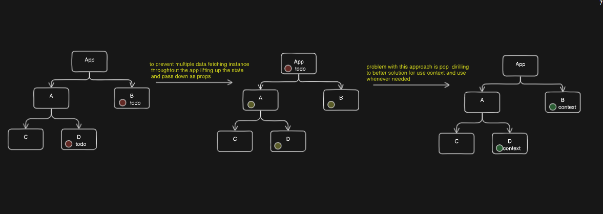
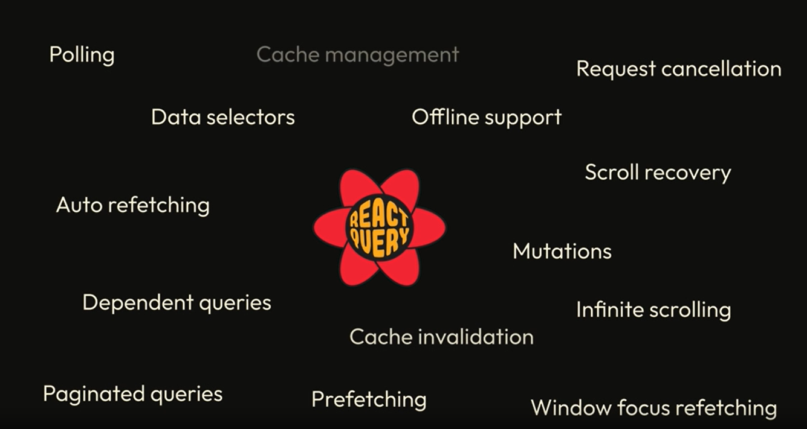

# REACT QUERY <svg xmlns="http://www.w3.org/2000/svg" width="1.12em" height="1em" viewBox="0 0 256 230"><path fill="#00435b" d="m157.98 142.487l-4.91 8.527a8.29 8.29 0 0 1-7.182 4.151H108.27a8.29 8.29 0 0 1-7.182-4.151l-4.911-8.527zm13.747-23.87l-8.658 15.034h-71.98l-8.658-15.034zm-8.34-23.342l8.354 14.506H82.417l8.354-14.506zm-17.5-22.066a8.29 8.29 0 0 1 7.183 4.151l5.228 9.079H95.86l5.229-9.079a8.29 8.29 0 0 1 7.182-4.151z"/><path fill="#002b3b" d="M53.523 69.252c-4.167-20.206-5.062-35.704-2.368-46.957c1.602-6.693 4.53-12.153 8.984-16.093c4.702-4.159 10.646-6.2 17.326-6.2c11.018 0 22.602 5.025 34.98 14.57c5.05 3.894 10.29 8.587 15.732 14.082c.434-.557.923-1.083 1.469-1.57c15.386-13.71 28.34-22.23 39.42-25.514c6.588-1.954 12.773-2.14 18.405-.244c5.946 2 10.683 6.137 14.026 11.93c5.516 9.561 6.97 22.124 4.914 37.637c-.838 6.323-2.271 13.21-4.296 20.673c.764.092 1.53.262 2.288.513c19.521 6.47 33.345 13.426 41.714 21.377c4.98 4.73 8.231 9.996 9.407 15.826c1.24 6.153.03 12.324-3.308 18.113c-5.506 9.548-15.63 17.077-30.052 23.041c-5.79 2.395-12.343 4.564-19.664 6.515c.334.754.594 1.555.767 2.395c4.167 20.206 5.061 35.704 2.368 46.957c-1.602 6.693-4.531 12.153-8.985 16.093c-4.701 4.159-10.646 6.2-17.325 6.2c-11.019 0-22.602-5.025-34.98-14.57c-5.104-3.936-10.402-8.687-15.907-14.258a11.7 11.7 0 0 1-2.084 2.442c-15.386 13.712-28.34 22.23-39.42 25.515c-6.588 1.954-12.773 2.14-18.405.244c-5.946-2-10.683-6.137-14.026-11.93c-5.516-9.561-6.97-22.124-4.914-37.637c.869-6.551 2.376-13.709 4.518-21.485a11.7 11.7 0 0 1-2.51-.537c-19.521-6.47-33.345-13.426-41.714-21.377c-4.98-4.73-8.231-9.996-9.407-15.826c-1.24-6.153-.03-12.325 3.308-18.114c5.506-9.547 15.63-17.077 30.052-23.04c5.963-2.467 12.734-4.693 20.32-6.689a12 12 0 0 1-.633-2.082"/><path fill="#ff4154" d="M189.647 161.333a3.684 3.684 0 0 1 4.235 2.81l.023.112l.207 1.075q10.065 52.915-14.18 52.915q-23.72 0-60.392-45.153a3.684 3.684 0 0 1 2.777-6.005h.114l1.288.009q15.432.084 30.004-1.076q17.2-1.37 35.924-4.687M78.646 134.667l.062.105l.646 1.127q7.765 13.5 16.18 25.627q9.912 14.28 22.29 28.914a3.684 3.684 0 0 1-.309 5.082l-.093.083l-.83.715q-40.96 35.096-53.244 14.012q-12.025-20.636 8.719-75.047a3.683 3.683 0 0 1 6.579-.618m124.857-52.054l.112.037l1.028.354q50.557 17.588 38.416 38.655q-11.874 20.605-69.041 30.004a3.683 3.683 0 0 1-3.773-5.501q8.188-13.928 14.749-27.717q7.44-15.638 13.965-33.57a3.684 3.684 0 0 1 4.432-2.295zM84.446 76.71a3.683 3.683 0 0 1 1.31 5.042q-8.19 13.927-14.75 27.717q-7.44 15.637-13.965 33.57a3.684 3.684 0 0 1-4.544 2.262l-.112-.037l-1.028-.355Q.8 127.322 12.941 106.255Q24.815 85.65 81.982 76.25c.85-.14 1.722.022 2.464.459m108.206-57.748q12.025 20.637-8.719 75.048a3.683 3.683 0 0 1-6.579.618l-.062-.105l-.646-1.127q-7.765-13.5-16.18-25.627q-9.912-14.28-22.29-28.914a3.684 3.684 0 0 1 .309-5.082l.093-.083l.83-.715q40.96-35.095 53.244-14.013M77.45 10.59q23.721 0 60.392 45.152a3.684 3.684 0 0 1-2.777 6.005h-.114l-1.288-.008q-15.431-.084-30.003 1.076q-17.202 1.37-35.925 4.687a3.684 3.684 0 0 1-4.234-2.81l-.024-.113l-.207-1.074Q53.204 10.59 77.45 10.59"/><path fill="#ffd94c" d="M111.295 73.67h31.576a12.89 12.89 0 0 1 11.181 6.475l15.855 27.626a12.89 12.89 0 0 1 0 12.834l-15.855 27.626a12.89 12.89 0 0 1-11.181 6.475h-31.576c-4.618 0-8.883-2.47-11.182-6.475L84.26 120.605a12.89 12.89 0 0 1 0-12.834l15.854-27.626a12.89 12.89 0 0 1 11.182-6.475m26.763 8.338c4.62 0 8.888 2.473 11.185 6.481l11.056 19.288a12.89 12.89 0 0 1 0 12.822l-11.056 19.288a12.89 12.89 0 0 1-11.185 6.48h-21.95c-4.62 0-8.888-2.472-11.185-6.48l-11.056-19.288a12.89 12.89 0 0 1 0-12.822l11.056-19.288a12.89 12.89 0 0 1 11.184-6.48zm-5.187 9.12h-11.576a12.89 12.89 0 0 0-11.179 6.47l-5.842 10.167a12.89 12.89 0 0 0 0 12.846l5.842 10.168a12.89 12.89 0 0 0 11.179 6.47h11.576c4.616 0 8.88-2.468 11.179-6.47l5.842-10.168a12.89 12.89 0 0 0 0-12.846l-5.842-10.168a12.89 12.89 0 0 0-11.179-6.47m-4.994 8.729c4.612 0 8.873 2.464 11.173 6.46l.829 1.44a12.89 12.89 0 0 1 0 12.862l-.829 1.44a12.89 12.89 0 0 1-11.173 6.46h-1.588a12.89 12.89 0 0 1-11.173-6.46l-.829-1.44a12.89 12.89 0 0 1 0-12.862l.829-1.44a12.89 12.89 0 0 1 11.173-6.46zm-.792 8.599a5.74 5.74 0 0 0-4.97 2.866a5.73 5.73 0 0 0 0 5.732a5.738 5.738 0 0 0 9.937 0a5.73 5.73 0 0 0 0-5.732a5.74 5.74 0 0 0-4.967-2.866m-46.509 5.732h10.32"/></svg>

## What @tanstack react query solve for us ?

> Believe or not, that problem is React To see why, we need to go back to the basics. In its most fundamental form, React is a library for building user interfaces. It's so simple that, historically, the entire mental model has often been represented as a formula where your View is simply a function of your application's State. **v=f(s)** `view=function(state)`

> All you have to do is worry about how the state in your application changes, and React will handle the rest.The primary mode of encapsulation for this concept is the component – which encapsulates both the visual representation of a particular piece of UI as well as the state and logic that goes along with it.

<div style="text-align: center;">
  
</div>

> By doing so, the same intuition you have about creating and composing together functions can directly apply to creating and composing components. However, instead of composing functions together to get some value, you can compose components together to get some UI.

> In fact, when you think about composition in React, odds are you think in terms of this UI composition since it's what React is so good at.

> The problem is in the real world, there's more to building an app than just the UI layer. It's not uncommon to need to compose and reuse non-visual logic as well.
> This is the fundamental problem that React hooks were created to solve.

**Just like a component enabled the composition and reusability of UI, hooks enabled the composition and reusability of non-visual logic.**

> What's interesting about all of the built-in hooks that React comes with, as you've probably experienced first hand, is that none of them are dedicated to arguably the most common use-case for building a real world web app – data fetching.

> The closest we can get out of the box with React is fetching data inside of useEffect, and then preserving the response with useState.

```JS
import * as React from 'react';

export default function App () {

  const [todo, setTodo]= React.UseState()
  const [id,setId]= React.UseState(1)

   React.UseEffect(()=>{

    const fetchTodo  = async () =>{
       setTodo(null)

        const response =await fetch(`https://dummyjson.com/todos/${id}`)
        const data  = await response.json()

        setTodo(data)
    }

    fetchTodo()

   },[id])

   return (
  <>
    <TodoCard data={todo}/>
    <ButtonGroup handleSetId={setId} />
  </>
)

function TodoCard({ data }) {
  if (!data) return null

  return (
    <div >
      <figure>
        
        <figcaption>
          <h4>{data.name}</h4>
          <h6>No. {data.id}</h6>
        </figcaption>
      </figure>
    </div>
  );
}


function ButtonGroup({ handleSetId }) {
  const handlePrevious = () => handleSetId((id) => id > 1 ? id - 1 : id)
  const handleNext = () => handleSetId((id) => id + 1)

  return (
    <div >
      <button name="previous" onClick={handlePrevious}>
        ←
      </button>
      <button name="next" onClick={handleNext}>
        →
      </button>
    </div>
  )
}

```

### What is the problem with that ?

> 1. The first problem, as you may have noticed if you played with the app, is we're not handling any loading states. This leads to one of the two deadliest UX sins – cumulative layout shift.
> 2. The second problem what if there is an error, then how coluld we hanndle, the may lead to crash the application.

> There are a few ways to solve this – the simplest being to just show an empty card when the request is in-flight.
> To do that, let's add some more state,

```JS
import * as React from 'react';

export default function App () {

  const [todo, setTodo]= React.UseState()
  const [id,setId]= React.UseState(1)
  const [isLoading, setIsLoading] = React.useState(true)
  const [error, setError] = React.useState(null)

   React.UseEffect(()=>{

    const fetchTodo  = async () =>{

    try {
        setTodo(null)
        setIsLoading(true)
        setError(null)

        const response =await fetch(`https://dummyjson.com/todos/${id}`)

        if (res.ok === false) {
          throw new Error(`Error fetching todo #${id}`)
        }

        const data  = await response.json()

        setTodo(data)
        setIsLoading(false)

    } catch (e) {
        setError(e.message)
        setIsLoading(false)
      }


    }

    fetchTodo()

   },[id])

   return (
  <>
    <TodoCard data={todo} isLoading={isLoading} error={error}/>
    <ButtonGroup handleSetId={setId} />
  </>
)

function TodoCard({ data,isLoading,error }) {
  if (error) return <div>Somethin went wrong while fetching todo...</div>

  if(isLoading)return <div>Loading...</div>
  return (
    <div>
      <figure>
        
        <figcaption>
          <h4>{data.name}</h4>
          <h6>No. {data.id}</h6>
        </figcaption>
      </figure>
    </div>
  );
}


function ButtonGroup({ handleSetId }) {
  const handlePrevious = () => handleSetId((id) => id > 1 ? id - 1 : id)
  const handleNext = () => handleSetId((id) => id + 1)

  return (
    <div >
      <button name="previous" onClick={handlePrevious}>
        ←
      </button>
      <button name="next" onClick={handleNext}>
        →
      </button>
    </div>
  )
}
```

> Unfortunately, we're still not quite done yet. In fact, as is, our code contains the worst kind of bug – one that is both inconspicuous and deceptively wasteful.

> Whenever we call fetch, because it's an asynchronous request, we have no idea how long that specific request will take to resolve. It's completely possible that, while we're in the process of waiting for a response, the user clicks one of our buttons, which causes a re-render, which causes our effect to run again with a different id.

> In this scenario, we now have **two requests** in flight, both with different **ids**. Worse, **_we have no way of knowing which one will resolve first_**. In both scenarios, we're calling `setTodo` when the request resolves. That means, because we don't know in which order they'll resolve, todo, and therefore our UI, will eventually be whatever request was resolved last. AKA, **_we have a race condition_**.
> To make it worse, you'll also get a flash of the UI card that resolves first, before the second one does

> How would we go about fixing it? By going deeper down the useEffect rabbit hole.
> Really what we want to do is to tell React to ignore any responses that come from requests that were made in effects that are no longer relevant. In order to do that, of course, we need a way to know if an effect is the latest one. If not, then we should ignore the response and not setTodo inside of it.(ignore stale responses.)

> To do this, we can utilize useEffect's cleanup function.
> If you return a function from your effect, React will call that function each time before it ever calls your effect again, and then one final time when the component is removed from the DOM.

> We can use this knowledge, along with the Power of JavaScript™ to fix our problem.
> Whenever the effect runs, let's make a variable called `ignore` and set it to `false`. Then, whenever the cleanup function runs (which we know will only happen when the effect is stale), we'll set `ignore` to `true`.

Then, all we have to do before we call setTodo or setError, is check to see if `ignore` is `true`. If it is, then we'll do nothing.

```JS
import * as React from 'react';

export default function App () {

  const [todo, setTodo]= React.UseState()
  const [id,setId]= React.UseState(1)
  const [isLoading, setIsLoading] = React.useState(true)
  const [error, setError] = React.useState(null)

   React.UseEffect(()=>{
    //add a flag for prevent race condition
    let ignore = false
    const fetchTodo  = async () =>{

    try {
        setTodo(null)
        setIsLoading(true)
        setError(null)

        const response =await fetch(`https://dummyjson.com/todos/${id}`)

       //check the flag
        if (ignore) {
          return
        }

        if (res.ok === false) {
          throw new Error(`Error fetching todo #${id}`)
        }

        const data  = await response.json()

        setTodo(data)
        setIsLoading(false)

    } catch (e) {
        setError(e.message)
        setIsLoading(false)
      }


    }

    fetchTodo()

    //clean up the flag.
     return () => {
      ignore = true
    }

   },[id])

   return (
  <>
   //...
  </>
)
```

> we can do better, abstract the no-visual logic into a custom hook.

```JS
import * as React from 'react';

export default function useQuery(url){
  const  [todo, setTodo]= React.UseState()
  const [isLoading, setIsLoading] = React.useState(true)
  const [error, setError] = React.useState(null)

   React.UseEffect(()=>{

    let ignore = false
    const fetchTodo  = async () =>{

    try {
        setTodo(null)
        setIsLoading(true)
        setError(null)

        const response =await fetch(url)


        if (ignore) {
          return
        }

        if (res.ok === false) {
          throw new Error(`Error fetching todo #${id}`)
        }

        const data  = await response.json()

        setTodo(data)
        setIsLoading(false)

    } catch (e) {
        setError(e.message)
        setIsLoading(false)
      }


    }

    fetchTodo()


     return () => {
      ignore = true
    }

   },[url])

 return { data, isLoading, error }
}


import * as React from "react"
import useQuery from "./useQuery"

export default function App () {
  const [id, setId] = React.useState(1)
  const { data: todo, isLoading, error } = useQuery(`https://dummyjson.com/todos/${id}`)
  return (
    <>
      <TodoCard
        isLoading={isLoading}
        data={todo}
        error={error}
      />
      <ButtonGroup handleSetId={setId} />
    </>
  )
}

```

> As is, our custom hook doesn't address another fundamental problem of using state and effects for data fetching: data duplication.

> By default, the fetched data is only ever local to the component that fetched it – that's how React works. That means, for every component that needs the same data, we have to refetch it.
> Every component will have its own instance of the state and every component has to show a loading indicator to the user while it gets it.
> Even worse, it's possible that while fetching to the same endpoint, one request could fail while the other succeeds. Or, one fetch could lead to data that is different than a subsequent request. Imagine fetching twice from the GitHub API, once receiving that an issue is open and soon after that it's closed because it was fixed.

> All the predictability that React offers just went out the window.
> It may seem unwarranted, but these are the kinds of problems that you will run into when you're fetching async data in a real-world application. To make it worse, these also just happen to be the kinds of problems that very few people think about.
> Now if you're an experienced React dev, you might be thinking that if the problem is that we're fetching the same data multiple times, can'?t we just move that state up to the nearest parent component and pass it down via props?
> Or better, put the fetched data on context so that it's available to any component that needs it?

<div style="text-align: center;">
  
</div>

```JS

import * as React from "react"

const queryContext = React.createContext([
  {},
  () => {}
])

export function QueryProvider({ children }) {
  const tuple = React.useState({})

  return (
    <queryContext.Provider value={tuple}>
      {children}
    </queryContext.Provider>
  )
}

export default function useQuery(url) {
  const [state, setState] = React.useContext(queryContext)

  React.useEffect(() => {
    const update = (newState) => setState((prevState) => ({
      ...prevState, [url]: { ...prevState[url], ...newState }
    }))

    let ignore = false

    const handleFetch = async () => {
      update({ data: null, isLoading: true, error: null })

      try {
        const res = await fetch(url)

        if (ignore) {
          return
        }

        if (res.ok === false) {
          throw new Error(`A network error occurred.`)
        }

        const data = await res.json()

        update({ data, isLoading: false, error: null })
      } catch (e) {
        update({ error: e.message, isLoading: false, data: null })
      }
    }

    handleFetch()
  }, [url])

  return state[url] || { data: null, isLoading: true, error: null }
}


```

> The biggest change (besides all the Context mess) is since our state is now "global", it needs to be able to store data | loading | error states for multiple urls. To achieve that, `we had to make our state an object where the url itself is the key`.

> With that, we've just introduced a small, in-memory
> cache and predictability has been restored.
> Unfortunately, we've traded in our predictability problem for an optimization problem.

> As you might know, React Context isn't a tool that's particularly good at distributing dynamic data throughout an application since it lacks a fundamental trait of state managers: being able to subscribe to pieces of your state.
> As is, any component that calls useQuery will be subscribed to the whole QueryContext, and therefore, will re-render whenever anything changes – even if the change isn't related to the url it cares about.

> Also, if two components call useQuery with the same url at the same time, unless we can figure out how to dedupe multiple requests, our app will still make two requests since useEffect is still called once per component.

> Oh and since we've introduced a cache, we also need to introduce a way to invalidate it – and as you may know, cache invalidation is hard.

> What started out as a simple, innocent pattern for fetching data in a React application has become a coffin of complexity – and unfortunately, there's not just one thing to blame.
>
> 1. useEffect is confusing.
> 2. Context often becomes confusing over time.
> 3. Combining useState, useEffect, and Context together in an attempt to "manage" state will lead to pain and suffering.
> 4. We're treating asynchronous state as if it were synchronous state.

> At this point #1-3 should be obvious, so let's dive into #4.

> Synchronous state is state that we're typically used to when working in the browser. It's our state, which is why it's often called client state. We can rely on it to be instantly available when we need it, and no one else can manipulate it, so it's always up-to-date.

### Client state

> 1.  Client owned: It's always up-to-date.
> 2.  Our state: Only we can change it
> 3.  Usually ephemeral: It goes away when the browser is closed.
> 4.  Synchronous: It's instantly available.

> All these traits make client state easy to work with since it's predictable. There isn't much that can go wrong if we're the only ones who can make updates to it.

> Asynchronous state, on the other hand, is state that is not ours. We have to get it from somewhere else, usually a server, which is why it's often called server state.
> It persists, usually in a database, which means it's not
> instantly available. This makes managing it, particularly over time, tricky.

### Server state

> 1.  Server owned: What we see is only a snapshot (which can be outdated).
> 2.  Owned by many users: Multiple users could change the data.
> 3.  Persisted remotely: It exists across browsing sessions.
> 4.  Asynchronous: It takes a bit of time for the data to go from the server to the client.

> Though it's far too common, it's problematic to treat these two kinds of states as equal.

> To manage client state in a React app, we have lots of options available, starting from the built-in hooks like useState and useReducer, all the way up to community maintained solutions like redux or zustand.

> But what are our options for managing server state in a React app?
> Historically, there weren't many. That is, until React Query came along.

Ironically, you may have heard that React Query is **_"the missing piece for data fetching in React"_**.

That couldn't be further from the truth. In fact...

**_React Query is not a data fetching library_**

> And that's a good thing! Because it should be clear by now that data fetching itself is not the hard part - it's managing that data over time that is.

> And while React Query goes very well with data fetching, <p style="font-size:32px;font-style:italic; font-weight:bold; text-decoration:underline;"> Better way to describe it is as an async state manager that is also acutely aware of the needs of server state.</p>

> In fact, React Query doesn't even fetch any data for you. You provide it a promise (whether from `fetch`, `axios`, `graphql`, `IndexedDB`, etc.), and React Query will then take the data that the promise resolves with and make it available wherever you need it throughout your entire application.

> From there, it can handle all of the dirty work that you're either unaware of, or you shouldn't be thinking about.

<div style="text-align: center;">
  
</div>
